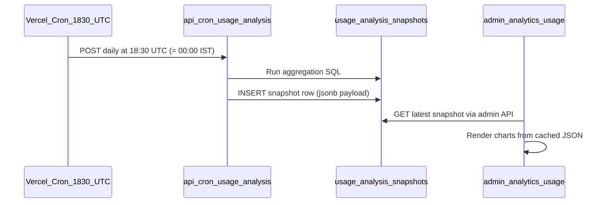

# Usage Analysis Admin Dashboard

## Scope (what we will and won't touch)

**In scope — admin island only:**
- New route: [`app/admin/analytics/usage/page.tsx`](app/admin/analytics/usage/page.tsx)
- New client dashboard: [`app/admin/analytics/UsageAnalysisDashboard.tsx`](app/admin/analytics/UsageAnalysisDashboard.tsx)
- New APIs: [`app/api/admin/usage-analysis/route.ts`](app/api/admin/usage-analysis/route.ts), [`app/api/cron/usage-analysis/route.ts`](app/api/cron/usage-analysis/route.ts)
- New server lib: [`lib/admin/usageAnalysis.server.ts`](lib/admin/usageAnalysis.server.ts)
- New migration: `supabase/migrations/*_usage_analysis_snapshots.sql`
- New cron config: [`vercel.json`](vercel.json)
- Nav discoverability: [`app/admin/AdminShell.tsx`](app/admin/AdminShell.tsx), [`app/admin/page.tsx`](app/admin/page.tsx)

**Out of scope — no main app changes:**
- No edits to [`app/api/chat/route.ts`](app/api/chat/route.ts), [`lib/store.ts`](lib/store.ts), canvas components, middleware, or landing page
- No `llm_usage_events` instrumentation (future enhancement if you want anonymous tracking)

---

## Investigation findings (data the page will show)

Supabase has **no billing table**. Token usage lives in `canvases.state → cards.*.turnUsage` (logged-in saved canvases only).

| Account | Total tokens | Share |
|---|---:|---:|
| ravisalugu@gmail.com | 647,005 | 49% |
| prem.pradeep97@gmail.com | 564,316 | 42% |
| All other 7 accounts | 120,519 | 9% |
| 4 accounts with activity but 0 tokens | 0 | 0% |

**Logged-in vs anonymous:** 100% of Supabase-tracked usage is logged-in. Anonymous API usage is **not persisted** — the dashboard will show an explicit "untracked gap" insight callout, not fake numbers.

**Non-Indian traffic:** GA US/France hits look like bots (1s engagement). Supabase shows **zero tracked tokens** from non-Indian accounts (e.g. ak5096@columbia.edu). The page will include a "likely region" column inferred from email domain + a traffic-quality insight card.

---

## Is nightly rollup heavy compute?

**No — not at your current scale.**

| Factor | Current reality | Impact |
|---|---|---|
| Canvas count | 47 rows | Tiny |
| Largest `state` JSON | ~950 KB | Postgres handles jsonb_each fine |
| Aggregation | One SQL query scanning all cards | **~2–5 seconds** once per day |
| Page load | Reads one pre-computed JSON row | **<100ms** |
| Cost | 1 cron invocation + 1 DB write/day | Negligible on Vercel Hobby/Pro + Supabase |

**When it would become heavy:** thousands of users with multi-MB canvas states each. At that point you'd shard rollups or move to incremental `llm_usage_events` logging. For beta (~13 users, ~47 canvases), pre-computed snapshots are the right choice.

---

## How midnight IST updates work

You chose: **pre-computed nightly snapshot only** + **IST midnight**.



### 1. Snapshot table (new migration)

```sql
create table public.usage_analysis_snapshots (
  id uuid primary key default gen_random_uuid(),
  computed_at timestamptz not null default now(),
  timezone text not null default 'Asia/Kolkata',
  payload jsonb not null,  -- full dashboard dataset
  stats jsonb not null     -- { total_tokens, user_count, duration_ms, ... }
);
-- RLS: no public access; service role only (same pattern as beta_suggestions)
```

Each nightly run **appends one row**. Admin page always reads `ORDER BY computed_at DESC LIMIT 1`.

### 2. Cron route

- **File:** [`app/api/cron/usage-analysis/route.ts`](app/api/cron/usage-analysis/route.ts)
- **Schedule:** `30 18 * * *` in [`vercel.json`](vercel.json) → **00:00 IST** daily
- **Auth:** `Authorization: Bearer $CRON_SECRET` (Vercel injects this automatically for cron jobs)
- **Action:** call `computeUsageAnalysisSnapshot()` → insert into `usage_analysis_snapshots`

On first deploy, run cron once manually (or seed snapshot via admin "Run now" button restricted to admins) so the page isn't empty.

### 3. Admin read API

- **File:** [`app/api/admin/usage-analysis/route.ts`](app/api/admin/usage-analysis/route.ts)
- **Auth:** [`getAdminUser()`](lib/adminAccess.server.ts) — same as beta suggestions
- **Returns:** latest snapshot payload + `computed_at` formatted in IST

Page never runs aggregation on load — only reads cached snapshot.

---

## Page design: "Usage Analysis"

**Route:** `/admin/analytics/usage`  
**Title:** Usage Analysis  
**Pattern:** Server page + `AdminShell` + client `UsageAnalysisDashboard` (mirrors [`BetaSuggestionsInbox.tsx`](app/admin/feedback/BetaSuggestionsInbox.tsx))

### Layout sections

#### A. Header strip
- Title + subtitle: "Token usage from saved canvases · last updated {IST timestamp}"
- Badge: "Snapshot · refreshes nightly at 12:00 AM IST"
- Data caveat pill: "Does not include anonymous or unsaved session usage"

#### B. KPI hero cards (4-up grid, animated count-up on load)
| Card | Value |
|---|---|
| Total tracked tokens | 1,331,840 |
| Active accounts w/ usage | 9 / 13 |
| Top consumer share | 49% (ravi) |
| Untracked gap | Unknown — callout |

#### C. Insight callouts (3 cards with icons)
Auto-generated from payload rules, e.g.:
- "Two accounts drive 91% of usage — ravi + prem"
- "US GA traffic shows bot pattern; zero Supabase tokens from US accounts"
- "4 canvases account for 66% of all tokens"

#### D. Charts (ECharts via existing `echarts-for-react`)

| Chart | Type | Interaction |
|---|---|---|
| Token share by account | Donut | Hover tooltips, click → filter table |
| Input vs output by account | Stacked horizontal bar | Sortable legend |
| Top 10 canvases | Bar | Click → show canvas title + owner |
| Signups vs canvas activity | Dual-axis line (last 30 days) | Zoom brush |
| Logged-in vs untracked | Donut (tracked solid + hatched "unknown") | Static explanatory |

Chart theming: reuse canvas design tokens (`#211F1C` dark / `#FFFFFF` light) via new `lib/admin/usageChartOptions.ts` — **does not touch** [`lib/echartsOptions.ts`](lib/echartsOptions.ts) artifact code.

#### E. Tables (sortable, sticky header)

**Account breakdown**

| Email | Input | Output | Total | Share | Canvases | Last active | Likely region |

**Top canvases**

| Owner | Canvas title | Tokens | Cards w/ usage | Updated |

Table interactions: column sort, search/filter by email, export CSV button (client-side from snapshot JSON).

#### F. Footer notes
- Methodology: data source = `canvases.state.cards.*.turnUsage`
- Limitations list (anonymous, other API routes, no geo in DB)

### Visual polish
- Subtle gradient hero background on KPI row
- Chart cards with `rounded-canvas`, soft shadow, hover lift
- Staggered fade-in on section mount (CSS only, no new deps)
- Responsive: 2-col charts on tablet, 1-col on mobile
- Respects existing admin shell sidebar + canvas tokens

---

## Aggregation payload shape

[`lib/admin/usageAnalysis.server.ts`](lib/admin/usageAnalysis.server.ts) builds:

```typescript
type UsageAnalysisSnapshot = {
  computedAt: string;           // ISO
  timezone: "Asia/Kolkata";
  summary: {
    totalInputTokens: number;
    totalOutputTokens: number;
    totalTokens: number;
    usersWithUsage: number;
    totalUsers: number;
    canvasesWithUsage: number;
    topAccountSharePct: number;
  };
  accounts: Array<{
    email: string;
    displayName: string | null;
    inputTokens: number;
    outputTokens: number;
    totalTokens: number;
    sharePct: number;
    canvasesWithUsage: number;
    lastSignInAt: string | null;
    signupAt: string;
    likelyRegion: "India" | "US" | "Unknown";
  }>;
  topCanvases: Array<{
    email: string;
    title: string;
    totalTokens: number;
    cardsWithUsage: number;
    updatedAt: string;
  }>;
  signupsByDay: Array<{ date: string; count: number }>;
  activityByDay: Array<{ date: string; canvasUpdates: number }>;
  insights: string[];           // auto-generated bullet strings
  limitations: string[];        // static + dynamic caveats
};
```

Core SQL reuses the investigation query (jsonb_each over `canvases.state->'cards'`).

**Region inference (heuristic, labeled in UI):**
- `.edu` domains → US
- Known team emails → India
- Else → Unknown

---

## Admin navigation update

Add to [`AdminShell.tsx`](app/admin/AdminShell.tsx) `NAV_GROUPS`:

```typescript
{
  label: "Analytics",
  items: [{ href: "/admin/analytics/usage", label: "Usage Analysis" }],
}
```

Add matching card on [`app/admin/page.tsx`](app/admin/page.tsx) dashboard grid.

---

## Environment variables

| Variable | Purpose |
|---|---|
| `CRON_SECRET` | Vercel auto-sets; validates cron route |
| `SUPABASE_SERVICE_ROLE_KEY` | Already used by beta-suggestions admin API |
| `ADMIN_ALLOWED_EMAILS` | Already gates admin access |

---

## Deploy checklist

1. Apply Supabase migration
2. Deploy with `vercel.json` cron
3. Trigger first snapshot (manual cron hit or one-time admin seed)
4. Verify `/admin/analytics/usage` loads for admin emails only
5. Confirm next-day IST snapshot appends new row

---

## Future enhancements (not in this build)

- Wire Anthropic console API for true billing totals + untracked gap number
- `llm_usage_events` table for real-time anonymous tracking (requires main API route changes — explicitly deferred)
- GA4 Data API integration for live country breakdown on same page

---

## Answer to your questions

**Is daily rollup heavy compute?**  
No. At ~47 canvases it is a few seconds of Postgres work once per day. The admin page reads a cached JSON snapshot, so visiting the dashboard is instant.

**How will it update every night?**  
Vercel Cron fires at **18:30 UTC (= midnight IST)**, hits a secured cron API route, runs the aggregation SQL, and writes one row to `usage_analysis_snapshots`. The Usage Analysis page always displays the latest snapshot timestamp — no live recompute on page load.
