# Flowstate — IP & Moat Report

**Prepared:** 15 July 2026
**Status:** Internal working document — living source of truth
**Scope:** What the Flowstate "engine" precisely is, what parts of it are legally protectable and how, what an acquirer would be buying, and how to deepen the moat.

> **This is not legal advice.** It is a technical and strategic map prepared so that a qualified IP lawyer (India and/or US) can act quickly and cheaply — the homework that normally costs billable hours is done here. Statutes, fees, and procedures cited should be verified as current before filing anything.

---

## 1. Executive summary

**What the engine is.** Flowstate's core is not a model and not a chat UI. It is a five-layer pipeline that converts a live conversation into a *typed, validated, versioned, portable artifact* — deciding on its own that "this answer should be a table / a map / a working UI," forcing the model to comply, validating the result against a strict schema, enriching it with real-world data, and rendering it on a branching spatial canvas where it can be edited, versioned, styled, exported, and shared. The model layer underneath is deliberately fungible (OpenRouter + Anthropic behind one interface) — which is exactly why the value sits in the layers above it.

**What's protectable, in one paragraph.** The *source code* (including the prompt text and intent heuristics as written) is protected by copyright automatically, in both India and the US, from the moment it was written. The *idea* of "conversation → artifact" is **not** copyrightable anywhere — no one can be. The realistic protection stack is: **copyright** on the code (register it — cheap, high leverage in any dispute), **trade secret** on the prompt corpus + intent-routing logic (requires hygiene you mostly already have, plus contracts you may not), **trademark** on the Flowstate name (cheapest high-value filing, but the namespace is crowded), and — only if you raise money or approach acquisition — a possible **patent** on the intent-routing + forced-typed-emission pipeline, with honest caveats about software patentability in both jurisdictions.

**Top five actions (details in §8):**

1. Register US copyright for the codebase (~$65, online) with trade-secret redacted deposit; register Indian copyright (Form XIV) for the same work.
2. File trademark applications for "Flowstate" in India (class 42/9) and, when budget allows, the US — after a clearance search, because the name is crowded.
3. Put IP assignment in writing for every human and AI-assisted contribution to the repo (including your own, assigned to the company entity once one exists).
4. Treat `lib/artifactPrompt.ts` + `lib/artifactIntent.ts` as trade secrets: keep the repo private, never ship prompt text to the client, add confidentiality terms to any collaborator/contractor agreement.
5. Keep the evidence chain pristine: the git history is your authorship record; the `branch-ai.md` chronology is a dated development diary. Both are exactly what an IP litigator wants.

---

## 2. The engine, precisely

### 2.1 The claim, grounded

The thesis — *"Flowstate understands that this information needs a table, this needs a custom UI"* — is not marketing language. It is implemented, and it is identifiable in five concrete layers. Every path below is a real file in this repository.

```mermaid
flowchart TD
    U["User message<br/>(conversation turn on a canvas card)"] --> D

    subgraph D ["LAYER 1 — Decision"]
        D1["lib/artifactIntent.ts<br/>regex intent classifiers<br/>(todo, table, chart, map, custom UI, calendar, timeline…)"]
        D2["lib/artifactPrompt.ts<br/>ARTIFACT_PROMPT — the master<br/>artifact-selection instruction set"]
        D3["app/api/chat/route.ts<br/>shouldForceArtifact → forced tool_choice<br/>+ MANDATORY per-turn system notes"]
    end

    D --> C

    subgraph C ["LAYER 2 — Contract"]
        C1["lib/llm/tools.ts<br/>EMIT_ARTIFACT_TOOL schema +<br/>createToolExecutor validation gate"]
        C2["lib/artifactTypes.ts<br/>~20-type discriminated ArtifactPayload union"]
        C3["Per-type normalizers<br/>lib/{table,custom,map,chart,timeline,<br/>calendar,todo,threeD,streetView}Artifact.ts"]
    end

    C --> E

    subgraph E ["LAYER 3 — Enrichment"]
        E1["lib/geocoding.ts — Nominatim geocoding for maps"]
        E2["lib/chartDataFetch.ts — Tavily research → numeric series"]
        E3["Wikimedia image search (lib/llm/tools.ts)"]
    end

    E --> M

    subgraph M ["LAYER 4 — Model plane (deliberately fungible)"]
        M1["lib/llm/provider.ts — neutral interface"]
        M2["anthropicProvider.ts / openrouterProvider.ts"]
        M3["lib/models.ts + admin-published OpenRouter models"]
    end

    M --> S

    subgraph S ["LAYER 5 — Surface"]
        S1["Branching canvas — lib/store.ts,<br/>lib/buildAncestorHistory.ts"]
        S2["Versioning — lib/sessionArtifacts.ts"]
        S3["Sync engine — lib/canvasOps.ts (op-log, LWW)"]
        S4["Style packs — lib/design/style/stylePacks.ts"]
        S5["Export registry — lib/artifactExport/registry.ts<br/>(PNG, CSV, XLSX, ICS, GeoJSON, Google Sheets…)"]
        S6["Sandboxed custom-UI rendering —<br/>components/cards/custom/DynamicUiFrame.tsx"]
    end

    S --> A["Typed, versioned, styled, exportable artifact<br/>on a shareable branching canvas"]
```

### 2.2 Layer 1 — Decision: "this needs a table"

Three mechanisms cooperate, and the redundancy is itself the design:

**(a) The master prompt** ([lib/artifactPrompt.ts](../lib/artifactPrompt.ts)) — ~110 lines of authored instruction telling the model when each artifact type applies and, critically, when it does *not*. It encodes judgment accumulated through iteration, e.g.:

> *"MANDATORY — tables: Never write a markdown pipe table … Whenever you would present 2+ columns of structured, comparison, ranked, or spec/attribute data … you MUST call emit_artifact with type "table" — even if the user did not say the word "table"."*

> *"Use timeline only for dated event chronologies (max 10-word labels), not numeric series."*

> *"Do not use map when the user only wants photographs (use search_images) or a custom itinerary UI (use custom or table)."*

The disambiguation rules (timeline vs. chart vs. calendar; map vs. table vs. streetview; todo vs. table) are the encoded "taste" of the product.

**(b) Deterministic intent classifiers** ([lib/artifactIntent.ts](../lib/artifactIntent.ts)) — regex-based detectors (`detectTodoListIntent`, `detectTableIntent`, `detectChartIntent`, `detectTravelMapIntent`, `detectCustomUiIntent`, `detectCalendarIntent`, `detectTimelineIntent`, `detectSpecificPlaceIntent`, `detectLiveDataIntent`, `detectInlineSourceInQuestion`) plus a priority resolver, `resolvePrimaryArtifactKind()`, that picks a single winning kind per turn. This layer runs *before* the model and does not depend on any model.

**(c) Enforcement** ([app/api/chat/route.ts](../app/api/chat/route.ts)) — when intent is detected, the request injects a per-turn "MANDATORY" system note (e.g. `TABLE_INTENT_SYSTEM_NOTE`) *and* can force the tool call outright via `tool_choice` on the first turn (`shouldForceArtifact` → `forceToolFirstTurn: "emit_artifact"`). The model is not trusted to remember; it is compelled.

The consequence: artifact emission is **model-independent behavior**. Swap GPT-4o for DeepSeek for Claude and the product still reliably produces a table when a table is due. That is the engineering substance behind "we are not in the model business."

### 2.3 Layer 2 — Contract: the typed artifact format

- `EMIT_ARTIFACT_TOOL` in [lib/llm/tools.ts](../lib/llm/tools.ts) defines the tool the model must call, with an enum of emission types: `table, code, video, custom, 3d, map, streetview, todo, calendar, timeline, chart`.
- [lib/artifactTypes.ts](../lib/artifactTypes.ts) defines the full `ArtifactPayload` discriminated union (~20 kinds including non-LLM kinds: website, repo, embed, google-doc, audio, stickynote).
- `createToolExecutor` is the validation gate: each emission runs through a per-type normalizer ([lib/tableArtifact.ts](../lib/tableArtifact.ts), [lib/customArtifact.ts](../lib/customArtifact.ts), [lib/chartArtifact.ts](../lib/chartArtifact.ts), etc.). Invalid emissions are rejected with an error string *fed back to the model* to retry — a closed correction loop, not a crash.

This is the product's *lingua franca*: a documented, versionable, machine-validated format for "an idea captured from a conversation." It is what makes the far vision (artifacts as transferable ideas that agents keep developing) coherent — agents can only continue work on artifacts because artifacts have a strict typed shape.

### 2.4 Layer 3 — Enrichment: grounding artifacts in reality

- Maps/Street View: the model is forbidden from inventing coordinates; `geocodeMapArtifact` ([lib/geocoding.ts](../lib/geocoding.ts)) resolves every place name via Nominatim server-side, derives zoom from place type, rate-limits to 1 req/s.
- Charts: `fetch_chart_data` ([lib/chartDataFetch.ts](../lib/chartDataFetch.ts)) researches real numbers via Tavily and regex-extracts series before the chart is emitted.
- Images: `search_images` returns real Wikimedia photographs rather than hallucinated URLs.

This layer converts "plausible-looking artifact" into "correct artifact" — a quality moat that pure prompt-wrapper competitors skip.

### 2.5 Layer 4 — Model plane: deliberately commodity

[lib/llm/provider.ts](../lib/llm/provider.ts) defines a neutral provider interface; [lib/llm/anthropicProvider.ts](../lib/llm/anthropicProvider.ts) and [lib/llm/openrouterProvider.ts](../lib/llm/openrouterProvider.ts) implement it; [lib/models.ts](../lib/models.ts) plus the admin-published model registry ([lib/modelConfig/publishedModels.server.ts](../lib/modelConfig/publishedModels.server.ts)) let new OpenRouter models be added *without a code change*. This is the architectural proof of the strategic position: models are an input cost, not the product.

### 2.6 Layer 5 — Surface: where artifacts live and travel

- **Branching canvas** — cards/threads/connections in [lib/store.ts](../lib/store.ts); branch-from-selection; ancestor history assembly ([lib/buildAncestorHistory.ts](../lib/buildAncestorHistory.ts)) so every branch inherits its lineage as context.
- **Versioning** — [lib/sessionArtifacts.ts](../lib/sessionArtifacts.ts): every artifact edit appends an `ArtifactVersion`; nothing is destructively overwritten.
- **Sync engine** — [lib/canvasOps.ts](../lib/canvasOps.ts) + `canvas_ops` migrations: a hand-rolled op-log (last-writer-wins entity deltas over a realtime broadcast channel, with snapshot compaction) — CRDT-lite collaboration infrastructure.
- **Style packs** — [lib/design/style/stylePacks.ts](../lib/design/style/stylePacks.ts) + [lib/design/style/resolveArtifactStyle.ts](../lib/design/style/resolveArtifactStyle.ts): named visual languages compiled to scoped CSS tokens, restyling any artifact without touching components.
- **Export registry** — [lib/artifactExport/registry.ts](../lib/artifactExport/registry.ts): per-kind export to PNG/JPEG/SVG, CSV/XLS/XLSX/Markdown, ICS, GeoJSON, embed HTML, code files, clipboard, and Google Sheets. This is the "artifacts as transferable ideas" vision already partially shipped.
- **Sandboxed custom UI** — [components/cards/custom/DynamicUiFrame.tsx](../components/cards/custom/DynamicUiFrame.tsx): AI-generated HTML/CSS/JS runs in an origin-isolated `<iframe sandbox="allow-scripts">` (no `allow-same-origin`), with escape-sequence hardening in `buildCustomSrcdoc`. Safe execution of AI-authored UI is a real engineering asset, not plumbing.

### 2.7 So what *is* "the engine," in one sentence?

> **A model-agnostic decision-and-contract system that detects, compels, validates, enriches, versions, and renders typed artifacts from conversation.**

When you say "we are in the business of communication," this is the machine that cashes that claim: the conversation is the input; the *communicable, transferable, structured unit of meaning* — the artifact — is the output; and everything proprietary sits between those two.

---

## 3. What an acquirer would be buying

If someone values or buys Flowstate, the diligence inventory looks like this, in descending order of the value they'd assign:

| # | Asset | Where it lives | Nature of value |
|---|---|---|---|
| 1 | **The decision layer** — prompt corpus + intent heuristics + enforcement logic | `lib/artifactPrompt.ts`, `lib/artifactIntent.ts`, force logic in `app/api/chat/route.ts` | Encoded product judgment; hardest to replicate correctly; the "engine" |
| 2 | **The artifact contract** — schemas, normalizers, correction loop | `lib/artifactTypes.ts`, `lib/llm/tools.ts`, per-type `lib/*Artifact.ts` | A de-facto interchange format for conversation-born artifacts; platform potential |
| 3 | **The branching canvas + context engine** | `lib/store.ts`, `lib/buildAncestorHistory.ts`, `lib/chatThreads.ts` | Novel UX + the lineage-aware context assembly that makes branches coherent |
| 4 | **Collaboration/sync engine** | `lib/canvasOps.ts`, `lib/collabOpsChannel.ts`, `supabase/migrations/*canvas_ops*` | Infrastructure that would take a competitor quarters to rebuild |
| 5 | **Rendering + style system** | `components/artifacts/*`, `lib/design/style/*`, `DynamicUiFrame.tsx` | 20-kind renderer catalog, token-driven restyling, sandboxing |
| 6 | **Export/portability layer** | `lib/artifactExport/*` | The "ideas travel" thesis, shipped |
| 7 | **Brand** — Flowstate name, visual identity | Marketing surface + `lib/design/` | Only as strong as trademark registration (currently: unregistered) |
| 8 | **Data & telemetry** | `qa_turn_events`, `usage_analysis_snapshots` (Supabase) | Raw material for a learned intent classifier — the flywheel (§7) |
| 9 | **User base & canvases** | Supabase `canvases`, `profiles` | Standard SaaS value; switching costs via stored versioned canvases |
| 10 | **Founder know-how** | You | Why decisions were made; usually captured via retention terms in a deal |

Two honest notes an acquirer's counsel would raise, better to fix now than during diligence:

- **Chain of title.** Every line of the repo must be traceably owned by the selling entity. Solo-founder code written before a company exists needs a written assignment into the company when incorporated. Any contractor, collaborator, or even friend who contributed needs a signed IP assignment. AI-assisted code (Cursor, Claude) is fine — but the *human-authored selections and arrangements* are what carry copyright (see §4.1), so keep authorship human-directed and documented.
- **Third-party dependencies.** The stack is clean (MIT/Apache npm deps; no GPL contamination visible in `package.json`), but the *service* dependencies carry terms an acquirer will read: Anthropic Commercial Terms, OpenRouter ToS, Nominatim Usage Policy (attribution required; 1 req/s limit is honored in code; heavy production use is expected to move to a paid geocoder), Google Maps Platform ToS (Street View), Tavily, Wikimedia. None of these look like blockers; all should be listed in a dependency register (§6.3).

---

## 4. IP protection map — instrument by instrument

The central legal fact to internalize: **the law does not offer one instrument that protects "the ability to decide this needs a table."** It offers four partial instruments, and the strategy is layering them.

### 4.1 Copyright — what it actually covers here

**Covered (automatically, in India and the US, from the moment of fixation — no registration required to *own* it):**

- **Source code** as a literary work. India: Copyright Act 1957, §2(o) expressly includes computer programmes as literary works. US: 17 U.S.C. §101/§102(a).
- **The prompt text** in `lib/artifactPrompt.ts` and the intent system notes in `lib/artifactIntent.ts` — as *written expression*. The specific wording, ordering, examples, and disambiguation rules are copyrightable text. A competitor who copies the prompt verbatim or near-verbatim infringes.
- **The UI** — visual design, original graphical elements, the written microcopy.
- **Documentation** — `branch-ai.md` and this document.
- **Selection and arrangement** — the specific curation of 20 artifact types, their priority ordering in `resolvePrimaryArtifactKind()`, the structure of the codebase — protected as compilation-style expression to the extent the choices are creative rather than dictated by function.

**NOT covered by copyright — anywhere, ever (this is the part to be clear-eyed about):**

- The **idea** of turning conversations into artifacts. Ideas, methods, systems, and procedures are expressly excluded: US 17 U.S.C. §102(b); the idea–expression dichotomy applies equally in Indian law (e.g., *R.G. Anand v. Delux Films*, SC 1978).
- The **behavior** of the system. A competitor may legally build a product that also detects "this needs a table" — as long as they write their own code and prompts.
- **Schemas and interfaces as functional systems.** The shape `{ columns, rows }` or the `emit_artifact` parameter format is largely functional; the merger doctrine (only so many ways to express it) and, in the US, *Google v. Oracle* (2021, API reimplementation as fair use) mean the *format itself* is weak copyright territory. The *documentation text describing* the format is protected; the format is effectively not.
- **Regex heuristics as method.** The specific regex strings are protected as literal code; the *technique* of regex intent detection is not.
- **AI-generated output.** Artifacts generated for users are not your copyright concern, but note: purely AI-generated code with no human creative direction has contested copyrightability (US Copyright Office has refused registration for machine-authored works). Your protection is strongest where a human authored, selected, and arranged. Your git history showing iterative human-directed development is helpful evidence here.

**What registration adds (why bother when protection is automatic):**

- **US:** you *cannot file an infringement suit* for a US work until registration (17 U.S.C. §411(a)). Registering **before infringement begins (or within 3 months of publication)** unlocks statutory damages up to $150,000/work for willful infringement and attorney's fees (§412) — without it you must prove actual damages, which for a pre-revenue product is near zero, making a lawsuit economically pointless. Registration is $45–$65 online. **This is the single highest-leverage/lowest-cost legal action available to you.**
- **India:** registration is optional and not a precondition to suit, but the registration certificate is prima facie evidence of ownership (§48) — it converts a dispute from "prove you wrote it" to "they must disprove it." Cheap (government fee on the order of ₹500 per literary work; verify the current fee schedule at copyright.gov.in).

### 4.2 Trade secret — the realistic primary shield for the decision layer

Because copyright can't stop a clean-room reimplementation of the *behavior*, the prompt corpus and intent-routing logic are best defended by **not letting competitors see them at all.** Trade secret protection exists exactly for this: information that (a) derives value from being secret and (b) is subject to reasonable secrecy efforts.

- **US:** Defend Trade Secrets Act (2016) — federal civil cause of action — plus state UTSA statutes.
- **India:** no trade-secret statute; protection is via contract (NDAs, confidentiality clauses) and the common-law action for breach of confidence. This makes **contracts the entire game in India** — without a signed confidentiality obligation, you may have no remedy.

**Current posture — mostly good, verify the gaps:**

| Requirement | Status |
|---|---|
| Repo private | ✅ (keep it that way; audit collaborator access) |
| Prompt text never shipped to the client | ✅ by architecture — `ARTIFACT_PROMPT` is assembled server-side in `app/api/chat/route.ts`; intent notes are server-side. **Keep it so** — any future feature that echoes system prompts into client-visible payloads breaks this. |
| NDAs / confidentiality with everyone who has seen the code | ⚠️ Verify. Every collaborator, contractor, beta tester with repo access, and (eventually) employee needs one. |
| Third-party AI providers | Anthropic/OpenRouter see the prompts at inference time. Their commercial terms disclaim training on API data (verify current OpenRouter terms and per-model provider pass-through policies — OpenRouter routes to many underlying providers with varying data policies; consider enabling OpenRouter's data-collection opt-out flags). |
| Marking | Add a short header comment to `artifactPrompt.ts` / `artifactIntent.ts` designating them confidential/trade secret — costs nothing, helps establish "reasonable efforts". |

**Important caveat:** prompts partially leak through model behavior — a determined competitor can infer much of the prompt by probing outputs. Trade secret slows and raises the cost of copying; it doesn't make copying impossible. The durable defense is the *flywheel* (§7), not the secret alone.

### 4.3 Patent — honest assessment

The only plausibly patentable subject matter here is the **pipeline as a technical method**: deterministic intent classification running ahead of the model + forced typed tool emission + schema validation with model-feedback correction loop + server-side grounding enrichment. Framed as "a method for reliable structured-output generation from unreliable language models," it has a technical-problem/technical-solution shape.

Reality check, both jurisdictions:

- **India:** Patents Act §3(k) excludes "computer programmes per se." The CRI Guidelines allow claims demonstrating a *technical effect/technical contribution* beyond the program itself. Arguable here (reliability/determinism of machine output is a technical effect), but outcomes are examiner-dependent.
- **US:** *Alice Corp v. CLS Bank* (2014) makes "abstract idea + do it with a computer" claims invalid under §101. Claims would need to be drafted around the concrete technical mechanism (forced tool_choice, validation-with-feedback loop, pre-model deterministic routing), not the idea of "AI picks a format."
- **Cost/time:** US utility patent realistically $15k–$30k+ in attorney fees, 2–4 years to grant. India is cheaper (startup fee reductions apply) but slower.
- **Prior art risk:** structured output / function calling / JSON-mode enforcement is a crowded, fast-moving space (OpenAI function calling 2023, Anthropic tool use, guidance/outlines libraries). A search is mandatory before spending.

**Recommendation:** do **not** file now on a bootstrap budget. Instead, file a **provisional application** (US, ~$1,600–$3,000 with an attorney, or India provisional) *only if* a fundraise or acquisition conversation becomes real within the next 12 months — a pending provisional is often enough to satisfy diligence and preserves a priority date for 12 months. Meanwhile, document invention dates (git history already does this).

Note the trade-off: a patent **publishes** the mechanism 18 months after filing, which conflicts with the trade-secret strategy on the same subject matter. You choose one per asset: the *prompt text* stays trade secret regardless; the *pipeline mechanism* is the patent candidate.

### 4.4 Trademark — cheap, urgent, and slightly complicated

The name **Flowstate** is where brand value accrues, and trademark is the only instrument that protects it. Two candid issues:

1. **Crowded namespace.** "Flow state" is a common psychology term and multiple software products use Flowstate/FlowState. A **clearance search** (India: ipindia.gov.in public search; US: USPTO TESS) is step zero — filing without one risks paying to discover a conflict.
2. **Descriptiveness.** Marks nodding at "flow" for productivity software are weaker; still registrable, but expect possible objections.

Process: India — file in Class 42 (SaaS) and Class 9 (downloadable software — the Electron app matters here) via ipindia.gov.in; government fee ₹4,500/class for individuals/startups (verify current). US — USPTO TEAS, $250–$350/class; requires use in commerce or intent-to-use. The Madrid Protocol can extend an Indian base application to the US later.

Also: register the domain(s) and social handles you care about now; and note the codebase's own referrer header advertises `flowstate.app` — make sure you actually control that domain.

### 4.5 Summary matrix

| Asset | Copyright | Trade secret | Patent | Trademark |
|---|---|---|---|---|
| Source code (all layers) | **Primary** — register US + India | Secondary (repo privacy) | — | — |
| Prompt corpus (`artifactPrompt.ts`) | Yes (as text) | **Primary** | — | — |
| Intent heuristics (`artifactIntent.ts`) | Yes (as code) | **Primary** | Part of pipeline claim | — |
| Pipeline mechanism (force → validate → correct → enrich) | No (method) | Partial | **Only candidate** — provisional, only if raising/selling | — |
| Artifact schema/format | Weak (functional) | No (visible in behavior) | Possibly as part of pipeline claim | — |
| Canvas UX / branching interaction | UI expression only | No (visible) | Design patent conceivable, low priority | — |
| Name & brand | Logo art: yes | — | — | **Primary** |
| Telemetry/data | Database rights weak in both jurisdictions | **Yes** (keep private) | — | — |

---

## 5. Registration playbooks

### 5.1 US copyright (do this first — highest leverage per dollar)

1. Go to copyright.gov → Registration Portal → Literary Works → "Computer Program."
2. Register the codebase as one work: *"Flowstate (computer program)"*, author = you (or the company, once assignment exists — if a company will exist soon, consider waiting days, not months, to register in its name).
3. **Deposit with trade-secret protection:** Circular 61 allows, for programs containing trade secrets, depositing the first 25 + last 25 pages of source with confidential portions **blocked out** (or other allowed combinations). Redact `artifactPrompt.ts` and `artifactIntent.ts` content from the deposit pages. This preserves the trade secret while securing registration.
4. Fee: $45 (single author, one work, not for hire) or $65 (standard). Processing: months, but *effective date is the filing date*.
5. Re-register periodically (e.g., annually or at major versions) — registration covers the code as deposited; later code is new material.

### 5.2 Indian copyright

1. copyright.gov.in → e-filing → **Form XIV**, category: Literary Work (computer programme) — note that since the 2021 amendment to the Copyright Rules, the source-code deposit requirement is relaxed: applicants may deposit **at least the first 10 and last 10 pages** of source code (or the whole if shorter). Apply the same redaction thinking as the US deposit.
2. Fee: on the order of ₹500 for a literary work (verify current schedule — software-related fees have varied).
3. Timeline: a mandatory 30-day objection window, then examination; total often 6–12 months. The certificate's value is evidentiary (§48 prima facie ownership), which is exactly what you want for "defend it in a legal issue."
4. If/when you incorporate: execute a **written assignment deed** (Copyright Act §19 requires assignments to be in writing, signed, identifying the work) moving all pre-incorporation IP from you personally into the company.

### 5.3 Trademarks

- **India:** clearance search → file TM-A online, Class 42 (+ Class 9), claim use since the date of first public availability. ₹4,500/class (individual/startup/small entity, verify). Expect 12–24 months to registration; you may use ™ immediately and ® only after registration.
- **US:** clearance search (knockout via USPTO search; consider a paid comprehensive search given the crowded name) → TEAS application. If not yet meaningfully "using in commerce" in the US, file intent-to-use.
- Decide early whether Flowstate is the defensible long-term name; if the clearance search comes back ugly, a rename is vastly cheaper now than after traction.

### 5.4 What NOT to spend on now

- Full utility patent prosecution (see §4.3 — provisional only, and only on a trigger event).
- Design patents on UI.
- International (Madrid/PCT) filings before product-market fit.

---

## 6. Defensibility in a dispute — the evidence layer

If you ever have to defend Flowstate, the case will be won on evidence assembled *now*, not at litigation time.

### 6.1 Authorship record — already strong

- **Git history** is a cryptographically-ordered, timestamped record of every line's authorship. Protect it: never rewrite published history on `main`; keep the remote (GitHub) as the canonical record; consider periodic signed tags.
- **`branch-ai.md` chronology** is a dated development diary — session-by-session, IST-timestamped, regenerated from `git log`. In an ownership dispute, this is the kind of contemporaneous record courts find persuasive. Keep running `npm run chronology:sync`.

### 6.2 Chain of title — the current gap

- [ ] Incorporate (or confirm the entity) and execute a **written IP assignment** of all Flowstate work from you personally to the entity.
- [ ] Written IP assignment + confidentiality from **every past contributor** — anyone who ever pushed a commit, designed an asset, or wrote copy. The git log tells you exactly who this is.
- [ ] Going forward: contractor/collaborator agreements with present-tense assignment language ("hereby assigns") — in India, remember §19's writing requirement; in the US, avoid relying on "work for hire" for contractors (it rarely applies to software) — use express assignment.
- [ ] Keep AI-coding-assistant usage human-directed and documented (commit messages describing intent already do this).

### 6.3 Third-party dependency register

Maintain a one-page register (an acquirer will ask for it; a litigator will too):

| Dependency | Type | Key obligation |
|---|---|---|
| npm packages (`package.json`) | MIT/Apache/ISC OSS | Attribution; no copyleft observed — re-audit on new deps (`npx license-checker`) |
| Anthropic API | Service | Commercial terms; no training on API data per current policy |
| OpenRouter | Service | Routes to many providers — verify per-provider data policies; consider data-collection opt-outs |
| Nominatim (OSM) | Service | Usage policy: attribution, 1 req/s (honored in `lib/geocoding.ts`); plan a paid geocoder before scale |
| Google Maps / Street View | Service | Maps Platform ToS — display and caching restrictions |
| Tavily, Wikimedia, Giphy | Service | API terms; Wikimedia images carry their own licenses — surface attribution where required |
| Cursor SDK (`@cursor/sdk`) | Service/SDK | Review terms re: code generated via the SDK inside your product |
| Supabase, Vercel | Infra | Standard; note data-location terms if selling to enterprises later |

### 6.4 If someone copies you — the realistic playbook

1. **Verbatim code/prompt theft** (ex-collaborator, leaked repo): copyright + breach of confidence claims; your registration certificates and git history make this the strong case. This is what registration buys.
2. **Behavioral cloning** (someone builds their own conversation-to-artifact product): no copyright claim; trademark protects only your name; a granted patent would be the only legal weapon — which is precisely why the durable answer is the economic moat (§7), not the courtroom.
3. **You are accused**: the dependency register + git history + clean-room provenance of your own code is the defense file. Keeping it current is cheap insurance.

---

## 7. The real moat — strategic framing

### 7.1 Separate the two questions

You asked "how do I copyright this" and "what is the differentiator" in one breath, and it's worth prying them apart:

- **Legal IP** stops *copying of your expression*. It is necessary hygiene and cheap. It will never stop a well-funded team from building a rival conversation-to-artifact product legally.
- **The moat** is what makes the rival's product *worse than yours for years even with your ideas in hand*. Legal IP is the fence; the moat is the compounding.

### 7.2 Where Flowstate's compounding actually lives

**1. Decision quality is a data flywheel — currently unlit.** The `qa_turn_events` and `usage_analysis_snapshots` tables already capture turns. The moat move: log *(question → artifact kind emitted → user's reaction — kept / edited / deleted / exported / re-asked)* and use it to (a) continuously tune the regex + prompt layer today, and (b) eventually train a small learned intent classifier that replaces regexes with something no competitor can replicate without your usage history. Every user interaction then makes the "this needs a table" judgment better. **This converts the engine from authored artifact (copyable-in-spirit) into accumulated asset (not copyable).**

**2. The artifact format is a network layer.** Your far vision — artifacts as transferable ideas that agents keep developing — implies the format matters more than any single canvas. The classic platform play: eventually *publish the artifact format as an open spec* (it's weakly protectable anyway, per §4.1) while keeping the engine that *produces and enriches* artifacts proprietary. Others rendering your format grows the network; only you generate high-quality instances. The export registry (`lib/artifactExport/`) is the seed of this.

**3. Switching costs via versioned canvases.** Every canvas with branching history and versioned artifacts (`lib/sessionArtifacts.ts`) is accumulated user investment. Deepen deliberately: make version history, branch lineage, and cross-canvas artifact reuse more valuable over time — data gravity is the oldest moat in SaaS.

**4. Grounding as a quality bar.** Enrichment (geocoding, data research, real images) is the difference between "demo" and "trustworthy." Each new enrichment (units, citations, live data feeds, entity resolution) widens the gap against prompt-wrapper clones, and none of it depends on models.

**5. Model-agnosticism as margin and resilience.** Because the decision layer is yours and deterministic, model price collapses *help* you (input costs fall, behavior stays constant). Products whose differentiation lives inside a vendor's model have the opposite exposure.

**6. The transcription vision extends, not replaces, the engine.** Real-conversation transcription is a new *input adapter* into the same Layer 1–3 pipeline. The strategic read: the pipeline is the platform; chat, transcription, and future agents are all just sources feeding it. Build every new feature as "another input into the artifact engine" and the engine's centrality — and its value in an acquisition — compounds.

### 7.3 How to think about all of this (the mental model you asked for)

> **You own a compiler.** Its source language is human conversation; its target language is a typed, portable artifact format; its optimizer is the decision layer. Model providers are interchangeable CPUs. Compilers are valued for the correctness of their output, the breadth of their target formats, and the ecosystems around them — never for the CPU they run on. Protect the compiler's source (copyright + secret), brand it (trademark), consider patenting its one novel compilation technique (the force-validate-correct loop), and above all make it *learn from every compilation* — because a compiler that improves with use is the only kind that cannot be cloned.

---

## 8. Action checklist

**This month (total cost roughly ₹10k–₹15k / ~$150 + attorney-free time):**

- [ ] US copyright registration of the codebase, redacted deposit (§5.1) — ~$65
- [ ] Indian copyright registration, Form XIV (§5.2) — ~₹500 + agent fee if used
- [ ] Trademark clearance searches for "Flowstate" (India + US) — free to start yourself
- [ ] Confidentiality header comments on `lib/artifactPrompt.ts` and `lib/artifactIntent.ts`
- [ ] Audit repo access; confirm private; list every historical contributor from `git log`
- [ ] Verify control of `flowstate.app` and key handles

**This quarter (₹15k–₹50k / a few hundred dollars + one lawyer consult):**

- [ ] Indian TM filing Class 42 (+9) if clearance is clean — ~₹4,500/class
- [ ] Incorporate / confirm entity; execute written IP assignment (you → company); collect assignments from any past contributors
- [ ] Standard collaborator/contractor agreement template with assignment + confidentiality (one lawyer session)
- [ ] Build the third-party dependency register (§6.3); run `npx license-checker` and archive output
- [ ] Turn on the flywheel: extend `qa_turn_events` to log artifact-kind outcomes and user reactions (§7.2.1)

**On trigger events (fundraise or acquisition talk):**

- [ ] US provisional patent on the intent-routing + forced-typed-emission + validate-correct pipeline (~$2k–$3k) — after a prior-art search
- [ ] US trademark filing (TEAS)
- [ ] Formal IP diligence self-audit against the §3 inventory

**Never (on current budget):**

- Full utility patent prosecution, design patents, Madrid/PCT — until scale justifies it.

---

*Prepared as internal analysis. Verify all statutes, fees, and procedures with a qualified IP practitioner in each jurisdiction before filing. Suggested next step: take this document to one IP lawyer consult in India (copyright + TM filing) — most of their discovery work is already done above, which should keep the engagement small.*
