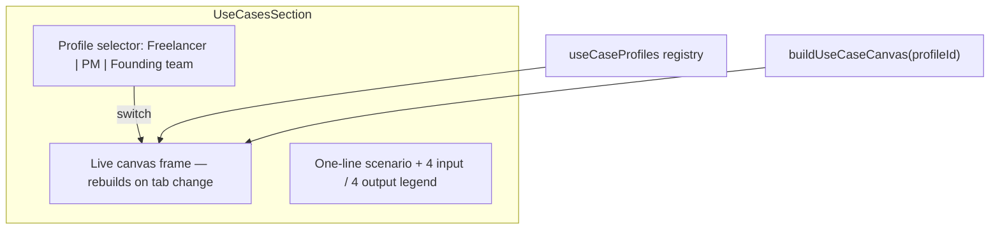

# Persona Use Case Canvases

> A switchable “Use cases” section with three live canvas demos—Design Freelancer, Product Manager, and Founding Team—each showing exactly 8 nodes (inputs + AI outputs) that tell a realistic spatial workflow story.

---

## Section concept

A single marketing section with **three pill tabs** at the top. Selecting a tab swaps the canvas below to a pre-seeded snapshot for that persona. The canvas is **read-only / demo mode**: pan and zoom allowed, but no editing—same interaction model as a product landing demo.



**Tab UX pattern:** pill buttons, active state filled (dark background on light card), optional sound/haptic on switch. Remount the canvas frame with `key={profileId}` so each tab loads a fresh snapshot.

**Suggested section copy**

| Field   | Copy                                                                                                                                                    |
| ------- | ------------------------------------------------------------------------------------------------------------------------------------------------------- |
| Eyebrow | Use cases                                                                                                                                               |
| Title   | One canvas, three ways people actually work                                                                                                             |
| Body    | Paste your references, branch your questions, and let outputs land beside the inputs—not buried in a scroll. Pick a profile to see a realistic session. |

---

## Canvas layout (shared across all three)

Each canvas holds **exactly 8 nodes**: **4 inputs** (left) + **4 outputs** (right). No chat cards unless you want a 9th element—stay at 8 total.

```
┌─────────────────────────────────────────────────────────┐
│  [Design freelancer ▾]  [Product manager]  [Founding team] │
├─────────────────────────────────────────────────────────┤
│                                                         │
│   INPUTS (×4)              OUTPUTS (×4)                 │
│   ┌──────────┐             ┌──────────┐                 │
│   │ brief    │             │ table    │                 │
│   ├──────────┤             ├──────────┤                 │
│   │ images   │             │ chart    │                 │
│   ├──────────┤             ├──────────┤                 │
│   │ figma    │             │ stickynote│                │
│   ├──────────┤             ├──────────┤                 │
│   │ audio    │             │ todo     │                 │
│   └──────────┘             └──────────┘                 │
│                                                         │
└─────────────────────────────────────────────────────────┘
```

- **Grid:** 2 columns × 4 rows, ~140px vertical gap, inputs at `x ≈ 120`, outputs at `x ≈ 720`.
- **Optional:** one small sticky label at top center naming the scenario (not counted in the 8).
- **Viewport:** auto-fit all 8 node bounds with ~120px padding on load and on tab switch.

---

## Profile 1 — Design freelancer

**Scenario:** *Client rebrand — redesign a fintech app onboarding flow.*

**Story arc:** Bring brief + mood + reference kit + client voice note → compare style directions, lock palette, capture decisions, track component work.

| #   | Role   | Type              | Title                      | Content / sample                                                                                                             |
| --- | ------ | ----------------- | -------------------------- | ---------------------------------------------------------------------------------------------------------------------------- |
| 1   | Input  | **Google Doc**    | Client brief               | Extracted text: rebrand goals, target audience (25–40 mobile-first), deliverables (onboarding + dashboard), deadline 3 weeks |
| 2   | Input  | **Images**        | Mood board                 | 2–3 reference images (lifestyle + UI screenshots); reuse catalog-style gallery                                               |
| 3   | Input  | **Embed (Figma)** | UI kit reference           | Public Figma mobile banking kit embed                                                                                        |
| 4   | Input  | **Audio**         | Client feedback memo       | ~60s synthetic voice note: “warmer, less corporate, keep trust cues”                                                         |
| 5   | Output | **Table**         | Style direction comparison | 3 concepts (Minimal / Bold / Playful) × columns: vibe, risk, client fit, recommendation tag                                  |
| 6   | Output | **Chart (bar)**   | Color usage split          | Primary / secondary / accent / neutral percentages for chosen direction                                                      |
| 7   | Output | **Sticky note**   | Design decisions           | Short bullets: type scale, corner radius, illustration vs photography                                                        |
| 8   | Output | **Todo**          | Component checklist        | Onboarding screens: splash, permissions, link bank, success state — with due tags                                            |

**Why these 8:** Covers the freelancer’s actual inputs (brief, refs, Figma, async feedback) and the artifacts they need to ship (comparison, palette, decisions, task list)—without exceeding the limit.

---

## Profile 2 — Product manager

**Scenario:** *Q1 launch planning for a mobile budgeting feature.*

**Story arc:** PRD + user evidence + competitive intel + problem framing → prioritize features, schedule release, define metrics, break into sprint work.

| #   | Role   | Type              | Title                         | Content / sample                                                                              |
| --- | ------ | ----------------- | ----------------------------- | --------------------------------------------------------------------------------------------- |
| 1   | Input  | **PDF asset**     | Feature PRD                   | Mobile budgeting PRD (goals, user stories, open questions)                                    |
| 2   | Input  | **Audio**         | User interview                | ~90s clip: pain points around “forgetting subscriptions” and “no shared household view”       |
| 3   | Input  | **Google Sheet**  | Competitive analysis          | Matrix: competitor × features, pricing, gaps (extracted text preview)                         |
| 4   | Input  | **Sticky note**   | Problem framing               | JTBD + north-star metric + out-of-scope list                                                  |
| 5   | Output | **Table**         | Feature prioritization (RICE) | Rows: shared budgets, subscription scan, alerts, export — with Reach/Impact/Confidence/Effort |
| 6   | Output | **Timeline**      | Release plan                  | Discovery → Beta → App Store → GA with month labels                                           |
| 7   | Output | **Chart (gauge)** | Success metric target         | e.g. “Week-4 retention” at 42% of 55% goal                                                    |
| 8   | Output | **Todo**          | Sprint 1 backlog              | 5–6 actionable items with priority chips                                                      |

**Why these 8:** Mirrors PM discovery → prioritization → planning → execution. Timeline + gauge + todo are distinct output types that read instantly on a canvas.

---

## Profile 3 — Founding team

**Scenario:** *Validate and ship an MVP for a B2B SaaS wedge.*

**Story arc:** Pitch narrative + market signal + technical reference + strategy notes → size market, plan GTM, track milestones, watch runway.

| #   | Role   | Type               | Title                   | Content / sample                                                    |
| --- | ------ | ------------------ | ----------------------- | ------------------------------------------------------------------- |
| 1   | Input  | **Markdown asset** | Pitch deck outline      | Problem, ICP, wedge, business model slides (outline, not full deck) |
| 2   | Input  | **Website**        | Market research link    | Analyst or competitor landing page preview (title, domain, favicon) |
| 3   | Input  | **Repo**           | Reference codebase      | Small open-source app repo dashboard (stack, README summary)        |
| 4   | Input  | **Sticky note**    | Strategy thesis         | ICP, wedge, pricing hypothesis, “what we’re not building yet”       |
| 5   | Output | **Table**          | TAM / SAM / SOM         | 3 rows with $ ranges and assumptions column                         |
| 6   | Output | **Timeline**       | 90-day GTM              | Build MVP → design partners → paid pilot → launch                   |
| 7   | Output | **Todo**           | MVP milestone checklist | Auth, core workflow, billing stub, onboarding — with done/pending   |
| 8   | Output | **Chart (gauge)**  | Runway remaining        | e.g. 14 months at current burn                                      |

**Why these 8:** Founders juggle narrative, market, build, and runway. Repo + website inputs show “research in context”; table + timeline + gauge outputs cover the three questions investors and the team ask weekly.

---

## Input / output type coverage

Across all three canvases you showcase **10 distinct node kinds** without repeating the same combo:

| Type           | Freelancer | PM        | Founding team |
| -------------- | ---------- | --------- | ------------- |
| Google Doc     | ✓          | ✓ (Sheet) | —             |
| Images         | ✓          | —         | —             |
| Embed (Figma)  | ✓          | —         | —             |
| Audio          | ✓          | ✓         | —             |
| PDF / MD asset | —          | ✓         | ✓             |
| Website        | —          | —         | ✓             |
| Repo           | —          | —         | ✓             |
| Sticky note    | ✓ (output) | ✓ (input) | ✓ (input)     |
| Table          | ✓          | ✓         | ✓             |
| Chart          | ✓ (bar)    | ✓ (gauge) | ✓ (gauge)     |
| Timeline       | —          | ✓         | ✓             |
| Todo           | ✓          | ✓         | ✓             |

---

## Tab metadata (for selector labels)

| Tab ID              | Label             | Subtitle (under tabs or in canvas caption) |
| ------------------- | ----------------- | ------------------------------------------ |
| `design-freelancer` | Design freelancer | Client rebrand — onboarding flow           |
| `product-manager`   | Product manager   | Q1 launch — budgeting feature              |
| `founding-team`     | Founding team     | MVP validation — B2B SaaS wedge            |

---

## Implementation checklist

When you build this on your page:

1. **Registry** — define persona id, label, subtitle, scenario, and 8 item definitions (role, kind, title, payload/sample ref).
2. **Snapshot builder** — spawn artifacts from payloads, assets from sample files, 2×4 grid layout.
3. **Section component** — pill tabs + canvas frame with `key={profileId}` and a snapshot builder per profile.
4. **Samples** — wire brief, mood board, PRD, pitch outline, and output payloads (reuse public assets where possible).
5. **Tab switch** — remount the frame with a new `key` on profile change (simplest), or re-hydrate the canvas store when `profileId` changes.

---

## Design review checklist

- Each canvas reads in **under 5 seconds**: 4 familiar inputs left, 4 clear outputs right.
- Tab switch feels instant (prebuilt snapshots; network only for live embeds like Figma, website, repo).
- Mobile: tabs scroll horizontally; canvas height ~520–560px; pinch/pan still works.
- Accessibility: tab list is a `tablist`; active tab has `aria-selected`; canvas has `aria-label` per persona.
